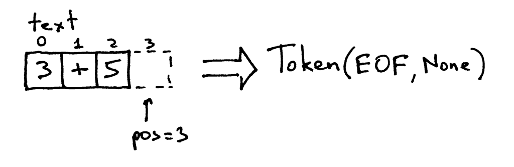

## 编写一个简单的解释器 Part 1.

[Let's Build A Simple Interpreter Part 1 原文链接](https://ruslanspivak.com/lsbasi-part1/)

> 如果你不了解编译器是如何工作的，那你一定不知道计算机是如何工作的。如果你不能保证100%的了解编译器是如何工作的，那就是不知道。

看到这句话，然后开始思考。显而易见，不管你是一个新手还是经验丰富的开发者，如果你不了解编译器是如何工作的，那你一定不知道计算机是如何工作的。

所以，你了解编译器和解释器是如何工作的么？我的意思是，保证100%的了解他们的工作机制？如果你的回答是不。


或者你已经对此感到焦虑。


不要担心，如果你跟着我这一系列的文章编写一个解释器和编译器之后，你就会知道它们是如何工作的了，并且你会变得乐观而自信。至少我是这么希望的。


为什么你要学着编写一个解释器和编译器？这里我给出三点原因：

1，编写一个解释器或编译器你必须同时使用很多技术技能，编写他们会帮助你提升你的技术技能，使你变成更加优秀的开发人员，并且这些技能你在任何开发中都会使用到，不仅仅是在编写解释器和编译器的时候。

2，你可以了解计算机是如何工作的，通常解释器和编译器看起来像是一种魔法，但是你对这样的魔法可能会感觉到不舒服，你希望可以通过编写一个解释器和编译器来了解他们是如何工作的，然后掌控他们。

3，你可以创造你自己的编程语言或领域专用语言，如果你想这么做的话，你需要为他们编写一个解释器或者编译器。最近，人们对新兴的语言充满了兴趣，并且几乎每天都会有新的语言产生，例如Elixir，Go，Rust等等。

好了，但是到底什么是解释器，什么是编译器呢？

解释器或编译器的目的都是将某种高等编程语言的源程序翻译成其他形式。这么说可能很模糊，但是跟上我，在接下来一系列的文章中，你会清晰的明白什么是源程序的翻译。

你可能还是会对解释器和编译器之间的区别感到疑惑，就本系列而言，我们认为如果一个“转换器”将源程序翻译成了机器语言，那它就是编译器。如果一个转换器在执行源程序时没有事先将它们翻译成机器语言，那它就是解释器。

我们可以看下图来进一步了解：


我希望你现在已经说服自己真的想学习并且编写一个解释器和编译器。

那么你对这个系列文章抱有什么样的期望呢？

我这里可以给你一个目标，我们将为Pascal语言的一个子集创建一个简单的解释器，在本系列的最后，你将拥有一个可工作的Pascal解释器和一个源代码级的调试器，就像python的pdb一样。

你可能会问，为什么是Pascal？首先，它不是我在本系列文章中提出的一种组合语言：它是一种真正的编程语言，具有许多重要的语言结构。有些古老，但是很好用，许多计算机科学的书籍在他们的例子使用Pascal语言（我知道这不是一个“为什么选择一种语言去为它编写解释器”的好的借口，当我认为，这样会比学习一门非主流的语言要好）。

下面是Pascal中的阶乘函数示例，您可以使用自己的解释器进行解释，并使用您将在此过程中创建的交互式源级调试器进行调试：

```pascal
program factorial;

function factorial(n: integer): longint;
begin
    if n = 0 then
        factorial := 1
    else
        factorial := n * factorial(n - 1);
end;

var
    n: integer;

begin
    for n := 0 to 16 do
        writeln(n, '! = ', factorial(n));
end.
```

我将使用Python作为实现Pascal解释器的语言，你可以使用任何你想使用的语言，因为这并不依赖任何特定的语言。好了，我们继续下面的工作吧，准备好了么，我们出发！

你在解释器和编译器上的第一次尝试，是为一个算术表达式编写一个简单的解释器，这也被称为计算器。今天的目标真的很简单，使你的计算器可以处理两个一位数字的加法，例如“3+5”，这是你计算器的源代码，抱歉，是解释器：

```python
# Token types
#
# EOF (end-of-file) token is used to indicate that
# there is no more input left for lexical analysis
INTEGER, PLUS, EOF = 'INTEGER', 'PLUS', 'EOF'


class Token(object):
    def __init__(self, type, value):
        # token type: INTEGER, PLUS, or EOF
        self.type = type
        # token value: 0, 1, 2. 3, 4, 5, 6, 7, 8, 9, '+', or None
        self.value = value

    def __str__(self):
        """String representation of the class instance.

        Examples:
            Token(INTEGER, 3)
            Token(PLUS '+')
        """
        return 'Token({type}, {value})'.format(
            type=self.type,
            value=repr(self.value)
        )

    def __repr__(self):
        return self.__str__()


class Interpreter(object):
    def __init__(self, text):
        # client string input, e.g. "3+5"
        self.text = text
        # self.pos is an index into self.text
        self.pos = 0
        # current token instance
        self.current_token = None

    def error(self):
        raise Exception('Error parsing input')

    def get_next_token(self):
        """Lexical analyzer (also known as scanner or tokenizer)

        This method is responsible for breaking a sentence
        apart into tokens. One token at a time.
        """
        text = self.text

        # is self.pos index past the end of the self.text ?
        # if so, then return EOF token because there is no more
        # input left to convert into tokens
        if self.pos > len(text) - 1:
            return Token(EOF, None)

        # get a character at the position self.pos and decide
        # what token to create based on the single character
        current_char = text[self.pos]

        # if the character is a digit then convert it to
        # integer, create an INTEGER token, increment self.pos
        # index to point to the next character after the digit,
        # and return the INTEGER token
        if current_char.isdigit():
            token = Token(INTEGER, int(current_char))
            self.pos += 1
            return token

        if current_char == '+':
            token = Token(PLUS, current_char)
            self.pos += 1
            return token

        self.error()

    def eat(self, token_type):
        # compare the current token type with the passed token
        # type and if they match then "eat" the current token
        # and assign the next token to the self.current_token,
        # otherwise raise an exception.
        if self.current_token.type == token_type:
            self.current_token = self.get_next_token()
        else:
            self.error()

    def expr(self):
        """expr -> INTEGER PLUS INTEGER"""
        # set current token to the first token taken from the input
        self.current_token = self.get_next_token()

        # we expect the current token to be a single-digit integer
        left = self.current_token
        self.eat(INTEGER)

        # we expect the current token to be a '+' token
        op = self.current_token
        self.eat(PLUS)

        # we expect the current token to be a single-digit integer
        right = self.current_token
        self.eat(INTEGER)
        # after the above call the self.current_token is set to
        # EOF token

        # at this point INTEGER PLUS INTEGER sequence of tokens
        # has been successfully found and the method can just
        # return the result of adding two integers, thus
        # effectively interpreting client input
        result = left.value + right.value
        return result


def main():
    while True:
        try:
            # To run under Python3 replace 'raw_input' call
            # with 'input'
            text = raw_input('calc> ')
        except EOFError:
            break
        if not text:
            continue
        interpreter = Interpreter(text)
        result = interpreter.expr()
        print(result)


if __name__ == '__main__':
    main()
```

保存上面的代码，将他们命名为calc1.py，在你深入了解它之前，先运行它，然后观察他们的行为，这是在我的笔记本电脑上输出的结果（如果你想使用Python3来运行它，需要将代码中的raw_input替换成input）：

```shell
$ python calc1.py
calc> 3+4
7
calc> 3+5
8
calc> 3+9
12
calc>
```

为了保证你的简易计算器在运行时不会抛出异常，你输入的算术表达式需要遵循以下几种规则：

* 输入的算术表达式中数字只允许有一位（小于10）；
* 只允许输入加号运算符（“+”）
* 任何地方都不允许有空白符

为了使我们的计算器更加简单，这些限制是必须的。不过不要紧，你很快就会让它支持更复杂的格式的，很快。

好的，现在让我们深入了解你的解释器是如何工作的，以及它如何处理算术表达式。

当您在命令行中输入表达式3+5时，您的解释器将获得一个字符串“3+5”。为了让解释器真正理解如何处理该字符串，首先需要将输入“3+5”分解为称为“Token”的组件。“Token”是具有类型和值的对象。例如，对于字符串“3”，“Token”的类型将为INTEGER，对应的值将为整数3。

将输入字符串分解为Token的过程称为词法分析。因此，解释器需要做的第一步是读取字符输入并将其转换为Token流。执行此操作的解释器部分称为词法分析器（lexical analyzer），简称lexer。您可能还会遇到不同的名称，例如scanner或tokenizer。它们的意思都是相同的：解释器或编译器中将字符输入转换为标记流的部分。

Interpreter类的方法get_next_token是你的词法分析器。每次调用它时，都会从传递给解释器的字符输入中获得下一个Token。让我们仔细看看方法本身，看看它实际上是如何将字符转换为Token的。输入存储在保存输入字符串的变量文本中，pos是该字符串的索引（将字符串视为字符数组）。 pos最初设置为0并指向字符“3”。该方法首先检查字符是否为数字，如果是，则递增pos并返回类型为INTEGER的标记实例，并将值设置为字符串'3'的整数值，即整数3：


pos现在指向文本中的“+”字符。下次调用该方法时，它会测试位置pos处的字符是否为数字，然后测试该字符是否为加号。结果，该方法递增pos并返回一个新创建的Token，其类型为PLUS，值为“+”：


pos现在指向字符'5'。再次调用get_next_token方法时，方法会检查它是否为数字，它会增加pos并返回一个新的类型为INTEGER的Token，值为整数5：


因为pos索引现在超过了字符串“3+5”的结尾，所以之后调用时，get_next_token方法都会返回类型为EOF的Token：



试一试，观察一下计算器的词法分析器组件的工作原理：

```python
>>> from calc1 import Interpreter
>>>
>>> interpreter = Interpreter('3+5')
>>> interpreter.get_next_token()
Token(INTEGER, 3)
>>>
>>> interpreter.get_next_token()
Token(PLUS, '+')
>>>
>>> interpreter.get_next_token()
Token(INTEGER, 5)
>>>
>>> interpreter.get_next_token()
Token(EOF, None)
>>>
```

所以既然你的解释器可以访问由输入字符组成的Token流，那么解释器需要对它做一些事情：它需要在从在词法分析器get_next_token方法中获得的Token流中找到以下结构：INTEGER -> PLUS -> INTEGER。也就是说，它试图找到一种Token的序列：整数后跟一个加号，之后跟一个整数。

负责查找和解释该结构的方法是expr。该方法验证Token序列确实是我们预期的Token序列，即INTEGER -> PLUS -> INTEGER。在成功确认结构之后，它通过将PLUS的左侧的值和PLUS的右侧的值相加来生成结果，从而可以成功地解释传递给解释器的算术表达式。

expr方法本身使用eat方法来验证传递给eat方法的Token类型是否与当前期望的Token类型匹配。若当次Token类型匹配，eat方法获取下一个令牌并将其赋值给current_token变量，从而有效地“吃掉”当前匹配的令牌并推进令牌流中的虚拟指针。如果Token流中的结构与预期的INTEGER -> PLUS -> INTEGER序列不匹配，则eat方法会抛出异常。

让我们回顾一下您的解释器为计算算术表达式所做的工作：

* 解释器接受一个输入字符串，比如说“3+5”
* 解释器调用expr方法来查找词法分析器get_next_token中返回的结构。它试图找到的结构是INTEGER -> PLUS -> INTEGER的形式。在查找到结构之后，它通过相加两个类型为INTEGER的值来解释输入，很明显解释器需要做的是将两个整数3和5相加。

祝贺自己吧，你刚刚学会了如何构建自己的第一个解释器！

接下来是练习时间。


你不认为你会读这篇文章就足够了，是吧？好，现在请亲手做以下练习：

1, 修改代码以允许输入中的多位整数，例如“12+3” <br/>
2, 添加一个跳过空白字符的方法，以便你的计算器可以处理带有空格字符的输入，如“ 12 + 3” <br/>
3, 修改代码，使用“-”来代替“+”使你的解释器可以处理减法，例如“7-5” <br/>

检验自己是否真的理解本篇文章的内容？

1，什么是解释器？ <br/>
2，什么是编译器？ <br/>
3，解释器和编译器之间的区别是什么？ <br/>
4，什么是token？ <br/>
5，将输入的文本转换成token流的过程叫什么？ <br/>
6，解释器中词法分析的那部分叫什么？ <br/>
7，解释器或编译器的“那部分（6问题中的）”的其他常用名称是什么？ <br/>

在我结束本篇文章之前，我真的希望你能够学习解释器和编译器。并且我希望你已经在做了。不要把它放在后面的计划中，不要等待。如果你只是简单的浏览了这篇文章，请重新开始仔细的阅读。如果你仔细阅读但没有做过练习 - 现在就做。如果你只做了其中一些练习，那么请将剩下的练习完成。你会明白它的思想。了解他是如何工作的，向我签署承诺，立即开始学习解释器和编译器！

我，________，身心健全，特此承诺承诺从今天开始学习解释器和编制者，并达到100％知道他们如何工作的地步！

签名：
日期：


签署名字和日期，并把它放在你每天都可以看到它的地方，以确保可以坚持你的承诺。并牢记承诺：

>“在激情退去之后，依然做你说过要做的事情。” -  Darren Hardy

好的，今天就是这样。在该系列的下一篇文章中，我们将扩展计算器以处理更多算术表达式，敬请关注。

如果您不能等到第二篇文章，并且正在努力开始深入挖掘解释器和编译器，那么我推荐的这些书籍列表将帮助您：

1, [Language Implementation Patterns: Create Your Own Domain-Specific and General Programming Languages (Pragmatic Programmers)](http://www.amazon.com/gp/product/193435645X/ref=as_li_tl?ie=UTF8&camp=1789&creative=9325&creativeASIN=193435645X&linkCode=as2&tag=russblo0b-20&linkId=MP4DCXDV6DJMEJBL)

2, [Writing Compilers and Interpreters: A Software Engineering Approach](http://www.amazon.com/gp/product/0470177071/ref=as_li_tl?ie=UTF8&camp=1789&creative=9325&creativeASIN=0470177071&linkCode=as2&tag=russblo0b-20&linkId=UCLGQTPIYSWYKRRM)

3, [Modern Compiler Implementation in Java](http://www.amazon.com/gp/product/052182060X/ref=as_li_tl?ie=UTF8&camp=1789&creative=9325&creativeASIN=052182060X&linkCode=as2&tag=russblo0b-20&linkId=ZSKKZMV7YWR22NMW)

4, [Modern Compiler Design](http://www.amazon.com/gp/product/1461446988/ref=as_li_tl?ie=UTF8&camp=1789&creative=9325&creativeASIN=1461446988&linkCode=as2&tag=russblo0b-20&linkId=PAXWJP5WCPZ7RKRD)

5, [Compilers: Principles, Techniques, and Tools (2nd Edition)](http://www.amazon.com/gp/product/0321486811/ref=as_li_tl?ie=UTF8&camp=1789&creative=9325&creativeASIN=0321486811&linkCode=as2&tag=russblo0b-20&linkId=GOEGDQG4HIHU56FQ)


