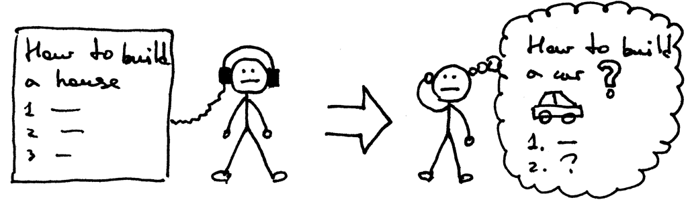
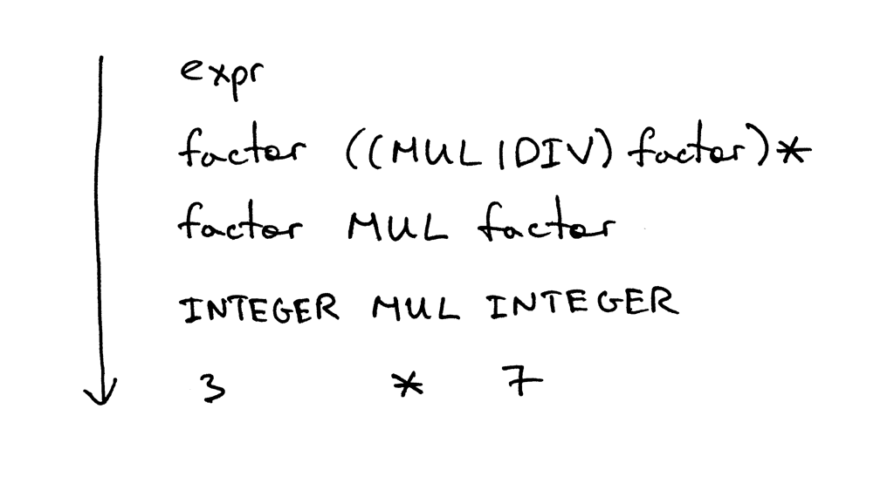
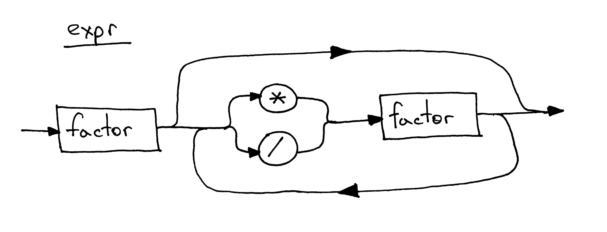

## 编写一个简单的解释器 Part 4.

[Let’s Build A Simple Interpreter. Part 4 原文链接](https://ruslanspivak.com/lsbasi-part4/)

你是否在被动地学习这些文章中的内容？或者你是否积极地练习？我希望你一直在积极地练习，真的:)

还记得孔子说的话吗？

> 不闻不若闻之，闻之不若见之，见之不若知之，知之不若行之。学至于行之而止矣。 《荀子-儒效》




在上一篇文章中，我们学习了如何解析（识别）并解释任意数量的加号或减号运算符的算术表达式，例如“7 - 3 + 2 - 1”。除此之外，还了解了语法图以及如何使用它们来指定编程语言的语法。

今天，我们将学习如何解析和解释任意数量的乘法和除法运算符组成的算术表达式，例如“7 * 4 / 2 * 3”。文中的除法将是整数除法，因此如果表达式为“9 / 4”，则答案将为整数：2。

今天还会谈到另一种广泛使用的符号来指定编程语言的语法。它被称为上下文无关语法（简称语法）或BNF（巴科斯-瑙尔范式，Backus-Naur Form）。出于本文的目的，我不会使用纯BNF表示法，而更像是修改后的EBNF（扩展巴科斯-瑙尔范式，Extend Backus-Naur Form）表示法。

以下是使用语法（上下文无关语法的简称，下面语法都代表上下文无关语法）的几个原因：

1，语法以简洁的方式指定编程语言的语法。与语法图不同，语法非常紧凑。你将在之后的文章中看到我越来越多地使用语法。<br/>
2，语法可以看做很好的文档。<br/>
3，即使从头开始手动编写解析器，语法也是一个很好的起点。通常，你可以通过一些简单的规则将语法转换为代码。<br/>
4，有一组工具，称为解析器生成器，它接受语法作为输入，并根据该语法自动为您生成解析器。我将在本系列的后面讨论这些工具。

这是一个描述算术表达式的语法，如“7 * 4 / 2 * 3”（它只是语法可以生成的众多表达式之一）：


语法由一系列规则(rule)组成，也可以称之为生产(production)。我们的语法有两个规则：


冒号的左侧由非终端组成，称之为生产的头部或者左侧。冒号的右侧一般由终端 and/or 非终端组成的，称之为生产的主体或右侧。


在我上面显示的语法中，像MUL，DIV和INTEGER这样的标记被称为终端，而像expr和factor这样的变量被称为非终端。非终端通常由一系列终端 and/or 非终端组成：


第一个规则左侧的非终端符号称为起始符号。在我们的语法中，开始符号是expr：


您可以将规则expr读作“expr可以是一个因子（factor），也可以在一个因子之后可选地加上乘法或除法运算符跟另一个因子，然后再可选地加上乘法或除法运算符后跟另一个因子，依此类推等等。”

有什么因子？在本文中，因子只是一个整数。

让我们快速浏览一下语法中使用的符号及其含义。

* | - 备择方案。一条竖杠表示“或”。因此（MUL | DIV）表示MUL或DIV。
* (...) - 一对圆括号如（MUL | DIV）表示由终端 and/or 非终端的分组。
* (...)* - 表示该组可以有0次或多次。

如果你之前使用过正则表达式，那么对符号|、()和(...)*应该非常熟悉。

语法通过解释它可以形成的句子来定义语言。这就是我们如何使用语法派生算术表达式：首先从开始符号expr开始，然后使用非终端的规则体重复替换非终端，直到你生成一个仅包含终端的句子为止。这些句子构成语法定义的语言。

如果语法无法派生某个算术表达式，那么它不支持该表达式，并且解析器在尝试识别表达式时将生成语法错误。

我想现在是时候举几个例子来说明一下了。

这就是语法派生表达式`3`的方式：


这是语法派生`3 * 7`的方式：



这是语法派生`3 * 7 / 2`的方式：


哇，这里好像有很多的理论！

我想当我第一次阅读有关语法，相关术语和所有爵士乐的内容时，我感觉像这样：


我可以向你保证，我肯定不是这样的：


我花了一些时间来熟悉这些符号，它是如何工作的，以及它与解析器和词法分析器的关系，并且我必须告诉你，从长远来看花费时间来学习它是值得的，因为它在实践和编译器文献中被广泛使用，你肯定会在某些时候遇到它。既然如此，我们当然应该尽早学会 :)

现在，我们将语法转换成代码，okey？

以下是我们将用于将语法转换为源代码的指示。遵循它们，我们就可以直接将语法翻译为解析器：

1，在语法中定义的每个规则R，变成相同名称的方法，并且对该规则的引用变为方法调用：R（）。该方法的主体遵循规则主体的变化。<br/>
2，将（a1 | a2 | aN）转换成为if-elif-else语句。<br/>
3，可选的分组（...）*转换成为一个可以循环零次或多次的while语句。<br/>
4, 每个Token引用T成为调用方法eat：eat（T）。eat方法的工作是，如果它与当前期望的Token匹配，它会使用Token T，然后从词法分析器获取一个新的Token，并将该Token分配给current_token内部变量。<br/>

他的图形看起来像是这样:


让我们按照上述指示进行操作来将语法转换为代码。

我们的语法中有两条规则：一条expr规则和一条factor规则。让我们从factor规则开始。根据指示，我们需要创建一个名为factor（指示1）的方法，该方法只需调用eat方法来使用INTEGER的Token（指示4）：

```python
def factor(self):
    self.eat(INTEGER)
```
这很简单，不是么？我们继续！

规则expr成为expr方法（同样根据指示1）。规则的主体以对factor成为factor（）方法调用的引用开始。可选的分组（...）*成为while循环，（MUL | DIV）替代变为if-elif-else语句。通过将这些部分组合在一起，我们得到以下expr方法：

```python
def expr(self):
    self.factor()

    while self.current_token.type in (MUL, DIV):
        token = self.current_token
        if token.type == MUL:
            self.eat(MUL)
            self.factor()
        elif token.type == DIV:
            self.eat(DIV)
            self.factor()
```

请花一些时间学习我是如何将语法映射到源代码的，并且确保你可以理解，因为它稍后会派上用场。

为方便起见，我将上面的代码放入parser.py文件中，该文件包含词法分析器和解析器，不带解释器。它有一个交互式提示符，你可以在其中输入表达式并查看它们是否有效：即，根据语法构建的解析器是否可以识别表达式。

这是我在计算机上运行的输出示例：

```shell
$ python parser.py
calc> 3
calc> 3 * 7
calc> 3 * 7 / 2
calc> 3 *
Traceback (most recent call last):
  File "parser.py", line 155, in <module>
    main()
  File "parser.py", line 151, in main
    parser.parse()
  File "parser.py", line 136, in parse
    self.expr()
  File "parser.py", line 130, in expr
    self.factor()
  File "parser.py", line 114, in factor
    self.eat(INTEGER)
  File "parser.py", line 107, in eat
    self.error()
  File "parser.py", line 97, in error
    raise Exception('Invalid syntax')
Exception: Invalid syntax
```

自己尝试一下！

我忍不住再次提到语法图。这是同一个expr规则的语法图的样子：



现在是时候我们更新我们算术表达式解释器的源代码了。下面是一个计算器的代码，它可以处理包含整数和任意数量的乘法和除法（整数除法）运算符的有效算术表达式。您还可以看到我将词法分析器重构为单独的类Lexer并更新了Interpreter类以将Lexer实例作为参数：

```python
# Token types
#
# EOF (end-of-file) token is used to indicate that
# there is no more input left for lexical analysis
INTEGER, MUL, DIV, EOF = 'INTEGER', 'MUL', 'DIV', 'EOF'


class Token(object):
    def __init__(self, type, value):
        # token type: INTEGER, MUL, DIV, or EOF
        self.type = type
        # token value: non-negative integer value, '*', '/', or None
        self.value = value

    def __str__(self):
        """String representation of the class instance.

        Examples:
            Token(INTEGER, 3)
            Token(MUL, '*')
        """
        return 'Token({type}, {value})'.format(
            type=self.type,
            value=repr(self.value)
        )

    def __repr__(self):
        return self.__str__()


class Lexer(object):
    def __init__(self, text):
        # client string input, e.g. "3 * 5", "12 / 3 * 4", etc
        self.text = text
        # self.pos is an index into self.text
        self.pos = 0
        self.current_char = self.text[self.pos]

    def error(self):
        raise Exception('Invalid character')

    def advance(self):
        """Advance the `pos` pointer and set the `current_char` variable."""
        self.pos += 1
        if self.pos > len(self.text) - 1:
            self.current_char = None  # Indicates end of input
        else:
            self.current_char = self.text[self.pos]

    def skip_whitespace(self):
        while self.current_char is not None and self.current_char.isspace():
            self.advance()

    def integer(self):
        """Return a (multidigit) integer consumed from the input."""
        result = ''
        while self.current_char is not None and self.current_char.isdigit():
            result += self.current_char
            self.advance()
        return int(result)

    def get_next_token(self):
        """Lexical analyzer (also known as scanner or tokenizer)

        This method is responsible for breaking a sentence
        apart into tokens. One token at a time.
        """
        while self.current_char is not None:

            if self.current_char.isspace():
                self.skip_whitespace()
                continue

            if self.current_char.isdigit():
                return Token(INTEGER, self.integer())

            if self.current_char == '*':
                self.advance()
                return Token(MUL, '*')

            if self.current_char == '/':
                self.advance()
                return Token(DIV, '/')

            self.error()

        return Token(EOF, None)


class Interpreter(object):
    def __init__(self, lexer):
        self.lexer = lexer
        # set current token to the first token taken from the input
        self.current_token = self.lexer.get_next_token()

    def error(self):
        raise Exception('Invalid syntax')

    def eat(self, token_type):
        # compare the current token type with the passed token
        # type and if they match then "eat" the current token
        # and assign the next token to the self.current_token,
        # otherwise raise an exception.
        if self.current_token.type == token_type:
            self.current_token = self.lexer.get_next_token()
        else:
            self.error()

    def factor(self):
        """Return an INTEGER token value.

        factor : INTEGER
        """
        token = self.current_token
        self.eat(INTEGER)
        return token.value

    def expr(self):
        """Arithmetic expression parser / interpreter.

        expr   : factor ((MUL | DIV) factor)*
        factor : INTEGER
        """
        result = self.factor()

        while self.current_token.type in (MUL, DIV):
            token = self.current_token
            if token.type == MUL:
                self.eat(MUL)
                result = result * self.factor()
            elif token.type == DIV:
                self.eat(DIV)
                result = result / self.factor()

        return result


def main():
    while True:
        try:
            # To run under Python3 replace 'raw_input' call
            # with 'input'
            text = raw_input('calc> ')
        except EOFError:
            break
        if not text:
            continue
        lexer = Lexer(text)
        interpreter = Interpreter(lexer)
        result = interpreter.expr()
        print(result)


if __name__ == '__main__':
    main()
```

将上面代码保存为calc4.py并且运行它，观察他的输出：

```shell
$ python calc4.py
calc> 7 * 4 / 2
14
calc> 7 * 4 / 2 * 3
42
calc> 10 * 4  * 2 * 3 / 8
30
```

我知道你可能没有等待这个部分 ：）今天的练习题：

* 编写一个描述包含任意数量的+，-，*或/运算符的算术表达式的语法。使用该语法，你应该能够导出类似“2 + 7 * 4”，“7 - 8 / 4”，“14 + 2 * 3 - 6 / 2”等表达式。
* 根据这个语法，写一个解释器。
* 如果你已完成上述练习，请放松并享受生活:)

##### 这是今天的检测：

记住今天文章中的语法，回答以下问题，如果需要请参考下图：


1，什么是上下文无关语法（语法）？<br/>
2，这个语法有多少个规则（产生）？<br/>
3，终端（terminal）是什么？<br/>
4，非终端是什么（non-terminal）？<br/>
5，一个规则的左边表示什么？<br/>
6，一个规则的右边表示什么？<br/>
7，语法的开始符号是什么？

嘿，你一直读到最后！这篇文章包含了相当多的理论，而你完成了它，我为你感到自豪。

我下次会回来看一篇新文章 - 敬请期待，不要忘记做练习，他们会帮到你。