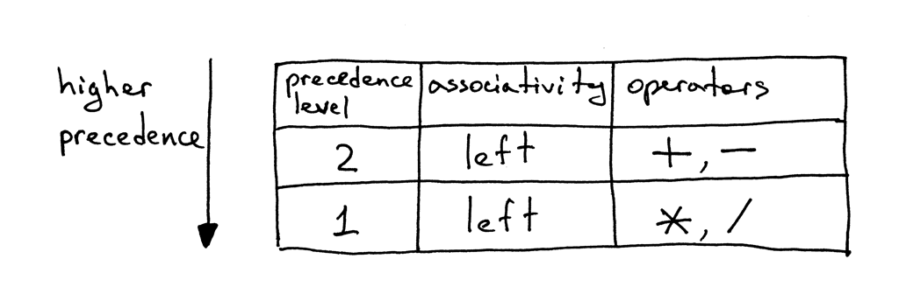
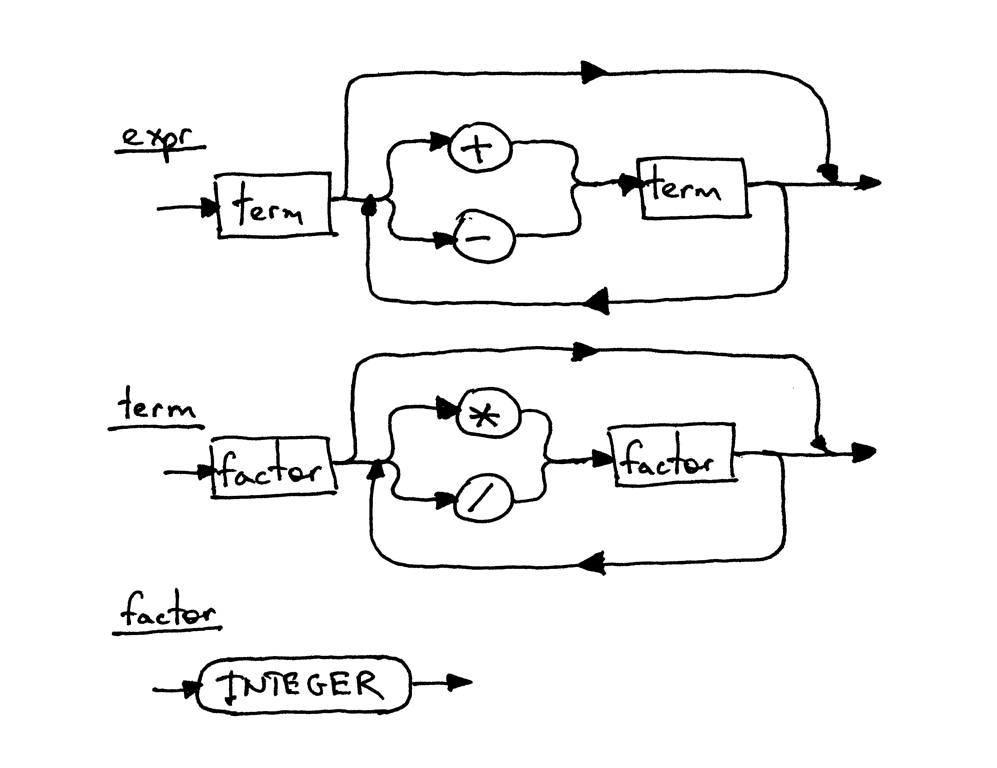

## 编写一个简单的解释器 Part 5.

[Let’s Build A Simple Interpreter. Part 5 原文链接](https://ruslanspivak.com/lsbasi-part5/)

你如何处理像"理解如何创建解释器或编译器"这样复杂的东西？在一开始它看起来非常像一堆纠缠在一起的纱线，你需要梳理开才能得到完美的球。

解决问题的方法是一次解开一个结。但有时候，你可能觉得自己不会马上理解某些事情，但你必须坚持下去。如果你足够坚持，它最终会被解决，我向你保证（哎呀，如果我每次不理解某些东西就放25美分，我很久以前就会变得富有:)。

在理解如何创建解释器和编译器的过程中，我能给你最好的建议就是阅读文章中的解释，阅读代码，然后自己编写代码，编写相同的代码。在一段时间内对内容和代码感觉自然，然后继续学习新主题。不要匆忙，只是放慢速度，花时间深入理解基本思想。这种看似缓慢的方法将在未来取得成效。相信我。

最终你将获得属于你完美的纱线球。而且，你知道吗？即使它不是那么完美，它仍然比无所作为，不学习或快速浏览它并在几天内忘记它这样的方案要好。

记住 - 只要保持一次解开一个结，并通过编写代码来练习你学到的东西，你真的会收获很多：


今天，你将使用您从之前系列文章中获得的所有知识，例如如何解析和解释具有任意数量的加法，减法，乘法和除法运算符的算术表达式。您将编写一个能够识别“14 + 2 * 3 - 6 / 2”等表达式的解释器。

在深入研究并编写一些代码之前，我们先谈谈运算符的关联性和优先级。

按照惯例，7 + 3 + 1与（7 + 3）+ 1相同，7 - 3 - 1相当于（7 - 3）- 1.这里没有什么值得惊讶的敌法。我们都在某一时刻学习到了这些，并且从那以后一直认为它是理所当然的。但如果我们将7 - 3 - 1视为7 -（3 - 1），结果将是意外的5而不是预期的3。

在普通算术和大多数编程语言中，加法，减法，乘法和除法是左关联的：

```
7 + 3 + 1 is equivalent to (7 + 3) + 1
7 - 3 - 1 is equivalent to (7 - 3) - 1
8 * 4 * 2 is equivalent to (8 * 4) * 2
8 / 4 / 2 is equivalent to (8 / 4) / 2
```

操作符的左关联到底是什么意思？

当表达式7 + 3 + 1中的操作数3在两边都有加号时，我们需要一个约定来决定哪个运算符适用于操作数3.它是属于左边的那个还是右边的？运算符加号关联到左边，因为两边都有加号的操作数属于左边的运算符，所以我们说运算符加号是左关联的。这就是为什么7 + 3 + 1等价于（7 + 3）+ 1。

好吧，那么像7 + 5 * 2那样的表达式，我们在操作数5的两边有不同类型的运算符？表达式是相当于7 +（5 * 2）还是（7 + 5）* 2？我们如何解决这种歧义？

在这种情况下，关联性约定对我们没有帮助，因为它仅适用于一种运算符，可以是加法（+， - ）或乘法（*，/）。当我们在同一个表达式中有不同类型的运算符时，我们需要另一个约定来解决歧义。我们需要一个定义运算符相对优先级的约定。

这就是：我们说如果运算符乘号和加号分别在操作数的两侧，那么乘号具有更高的优先级。在我们知道和使用的算术中，乘法和除法具有比加法和减法更高的优先级。结果表达式7 + 5 * 2相当于7 +（5 * 2），表达式7 - 8 / 4相当于7 -（8 / 4）。

在我们有一个具有相同优先级的运算符的表达式的情况下，我们只使用关联约定并从左到右执行运算符：

```
7 + 3 - 1 is equivalent to (7 + 3) - 1
8 / 4 * 2 is equivalent to (8 / 4) * 2
```

我希望你不要因为大量的谈论操作符的关联性和优先性而让你感到厌烦。这些约定的好处是我们可以从一个显示算术运算符的关联性和优先级的表中构造算术表达式的语法，然后，我们可以按照上一篇文章中的指示将语法翻译成代码，除了关联性之外，我们的解释器还能够处理运算符的优先级。

好了，这就是我们优先级的表：



从表中可以看出，运算符加号和减号具有相同的优先级，并且它们都是左关联的。您还可以看到运算符乘号和除号也是左关联的，它们之间具有相同的优先级，但具有比加法和减法运算符更高的优先级。

以下是如何从优先级表构造语法的规则：

1. 对于每个优先级别定义一个非终端。非终端的生产主体应该包含来自该级别的算术运算符和非终端的下一个更高级别的优先级。<br/>
2. 为基本的表达式单元创建一个额外的非终端因子，在我们的例子中是整数。一般规则是，如果您有N级优先级，则总共需要N + 1个非终端：每个级别一个非终端加一个基本表达单元的非终端。

哇，让我们遵循这些规则来构建我们的语法。

根据规则1，我们将定义两个非终端：一个非终端是第二级的expr，一个非终端为第一级的term。按照规则2，我们将为基本的算术单位定义一个非终端factor表达式，用来生成整数。

我们的新语法的起始符号将是expr，expr生成部分将包含一个表示二级优先运算符的主体，在我们的例子中是运算符加号和减号，并且将包含用于下一个更高级别的非终端运算符term：


term生成部分将有一个表示使用一级优先运算符的主体，它们是运算符乘号和除号，它将包含基本单位表达式的非终端factor：


然后非终端factor的生成部分：


你已经在之前的文章中看到了以上都是作为语法和语法图的一部分，但是在这里我们将它们组合成一个语法来处理运算符的关联性和优先级：


这是与上面的语法相对应的语法图：



图中的每个矩形框都是一个“方法调用”。如果你使用表达式7 + 5 * 2并从顶部图表expr开始并向下走到最底部的factor，你应该能够看到优先级序列较低（实际优先级高）运算符乘号和除号在下图中执行在加号和减号之前。

为了彻底了解运算符的优先级，让我们看一下，根据上面的语法和语法图完成的对算术表达式7 + 5 * 2的分解。这只是表明高优先级运算符运算在低优先级运算符之前：


好的，让我们按照之前的指示将语法转换为代码，看看我们的新解释器是如何工作的，我们先再来看一次之前语法：


这里是完整的计算器代码，可以处理包含整数和任意数量的加法，减法，乘法和除法运算符的有效算术表达式。

以下是与上一篇代码相比的主要变化：

* Lexer类现在可以标记+， - ，*和 /（这里没什么新东西，我们只是将以前文章中的代码组合成一个支持所有这些标记的类）
* 回想一下，语法中定义的每个规则R都成为一个具有相同名称的方法，并且对该规则的引用成为方法调用：R（）。因此，Interpreter类现在有三个方法对应于语法中的非终端：expr，term和factor。

源代码：
```python
# Token types
#
# EOF (end-of-file) token is used to indicate that
# there is no more input left for lexical analysis
INTEGER, PLUS, MINUS, MUL, DIV, EOF = (
    'INTEGER', 'PLUS', 'MINUS', 'MUL', 'DIV', 'EOF'
)


class Token(object):
    def __init__(self, type, value):
        # token type: INTEGER, PLUS, MINUS, MUL, DIV, or EOF
        self.type = type
        # token value: non-negative integer value, '+', '-', '*', '/', or None
        self.value = value

    def __str__(self):
        """String representation of the class instance.

        Examples:
            Token(INTEGER, 3)
            Token(PLUS, '+')
            Token(MUL, '*')
        """
        return 'Token({type}, {value})'.format(
            type=self.type,
            value=repr(self.value)
        )

    def __repr__(self):
        return self.__str__()


class Lexer(object):
    def __init__(self, text):
        # client string input, e.g. "3 * 5", "12 / 3 * 4", etc
        self.text = text
        # self.pos is an index into self.text
        self.pos = 0
        self.current_char = self.text[self.pos]

    def error(self):
        raise Exception('Invalid character')

    def advance(self):
        """Advance the `pos` pointer and set the `current_char` variable."""
        self.pos += 1
        if self.pos > len(self.text) - 1:
            self.current_char = None  # Indicates end of input
        else:
            self.current_char = self.text[self.pos]

    def skip_whitespace(self):
        while self.current_char is not None and self.current_char.isspace():
            self.advance()

    def integer(self):
        """Return a (multidigit) integer consumed from the input."""
        result = ''
        while self.current_char is not None and self.current_char.isdigit():
            result += self.current_char
            self.advance()
        return int(result)

    def get_next_token(self):
        """Lexical analyzer (also known as scanner or tokenizer)

        This method is responsible for breaking a sentence
        apart into tokens. One token at a time.
        """
        while self.current_char is not None:

            if self.current_char.isspace():
                self.skip_whitespace()
                continue

            if self.current_char.isdigit():
                return Token(INTEGER, self.integer())

            if self.current_char == '+':
                self.advance()
                return Token(PLUS, '+')

            if self.current_char == '-':
                self.advance()
                return Token(MINUS, '-')

            if self.current_char == '*':
                self.advance()
                return Token(MUL, '*')

            if self.current_char == '/':
                self.advance()
                return Token(DIV, '/')

            self.error()

        return Token(EOF, None)


class Interpreter(object):
    def __init__(self, lexer):
        self.lexer = lexer
        # set current token to the first token taken from the input
        self.current_token = self.lexer.get_next_token()

    def error(self):
        raise Exception('Invalid syntax')

    def eat(self, token_type):
        # compare the current token type with the passed token
        # type and if they match then "eat" the current token
        # and assign the next token to the self.current_token,
        # otherwise raise an exception.
        if self.current_token.type == token_type:
            self.current_token = self.lexer.get_next_token()
        else:
            self.error()

    def factor(self):
        """factor : INTEGER"""
        token = self.current_token
        self.eat(INTEGER)
        return token.value

    def term(self):
        """term : factor ((MUL | DIV) factor)*"""
        result = self.factor()

        while self.current_token.type in (MUL, DIV):
            token = self.current_token
            if token.type == MUL:
                self.eat(MUL)
                result = result * self.factor()
            elif token.type == DIV:
                self.eat(DIV)
                result = result / self.factor()

        return result

    def expr(self):
        """Arithmetic expression parser / interpreter.

        calc>  14 + 2 * 3 - 6 / 2
        17

        expr   : term ((PLUS | MINUS) term)*
        term   : factor ((MUL | DIV) factor)*
        factor : INTEGER
        """
        result = self.term()

        while self.current_token.type in (PLUS, MINUS):
            token = self.current_token
            if token.type == PLUS:
                self.eat(PLUS)
                result = result + self.term()
            elif token.type == MINUS:
                self.eat(MINUS)
                result = result - self.term()

        return result


def main():
    while True:
        try:
            # To run under Python3 replace 'raw_input' call
            # with 'input'
            text = raw_input('calc> ')
        except EOFError:
            break
        if not text:
            continue
        lexer = Lexer(text)
        interpreter = Interpreter(lexer)
        result = interpreter.expr()
        print(result)


if __name__ == '__main__':
    main()
```

将上面的代码保存并将文件命名为calc5.py，然后在电脑上执行并查看输出：

```shell
$ python calc5.py
calc> 3
3
calc> 2 + 7 * 4
30
calc> 7 - 8 / 4
5
calc> 14 + 2 * 3 - 6 / 2
17
```

下面是今天的练习：


* 按照本文中的描述编写一个解释器，而不是重复文章中的代码。为你的编译器写一些测试，并确保他们通过。
* 扩展解释器以处理包含括号的算术表达式，以便您的解释器可以评估深层嵌套的算术表达式，如：7 + 3 *（10 /（12 /（3 + 1）- 1））

检测你是否了解今天的内容。

1. 什么是操作符的左关联？<br/>
2. 操作符加号和减号是左关联还是右关联？乘号和除号呢？<br/>
3. 加号是否比乘号的优先级更高？

嘿，你一直读到最后！那真的很棒。下次我会回来一篇新文章 ———— 敬请关注，会像往常一样精彩，并且，不要忘记做练习。
