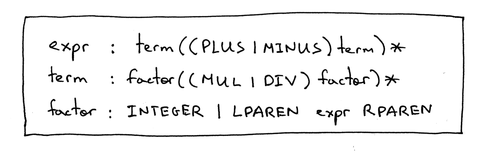
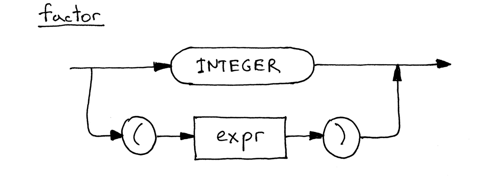
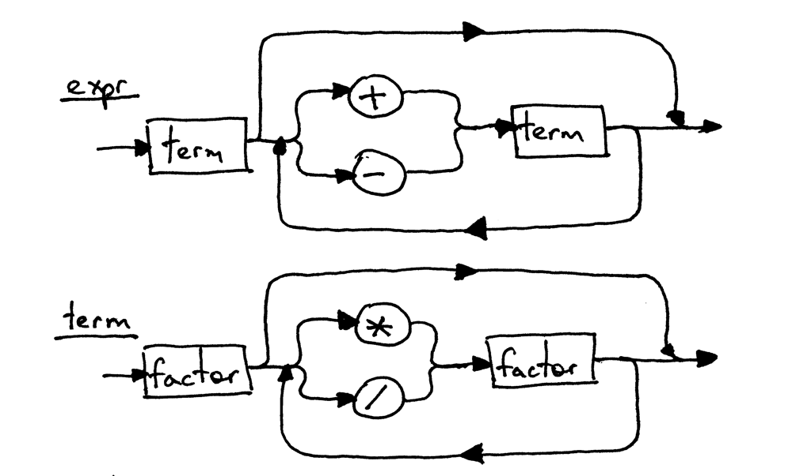
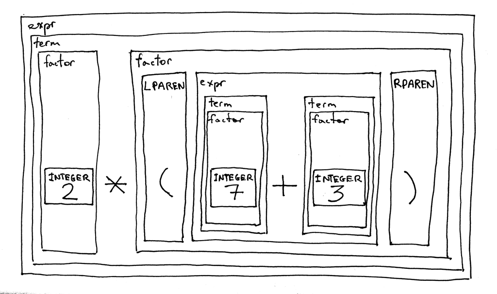

## 编写一个简单的解释器 Part 6.

[Let’s Build A Simple Interpreter. Part 6 原文链接](https://ruslanspivak.com/lsbasi-part6/)

今天是重要的一天:)你可能会问“为什么”。原因是今天我们将通过在我们的语法中添加带括号的表达式并实现一个能够计算任意深度嵌套括号的表达式的解释器来完成对算术表达式的讨论，就像表达式7 + 3 *（10 /（12 /（3 + 1）- 1））这样。

我们现在就开始吧。

首先，让我们修改语法以支持带括号的表达式。我们在上一篇文章中做的那样，factor规则用于表达式中的基本单位。在那篇文章中，我们唯一的基本单位是整数（integer）。今天我们要添加另一个基本单元 ———— 带括号的表达式。我们开始做吧。

这是修改过的语法：



expr和term的生成部分与上一篇文章完全相同，唯一的变化是factor的生成部分，其中终端LPAREN代表左括号'（'，终端RPAREN代表右括号'）'，括号之间的expr指的是expr规则。

以下是factor更新后的语法图，现在包含可选方案：



因为expr和term的语法规则没有改变，所以它们的语法图与上一篇文章中的相同：



这是我们新语法的一个有趣的新特性 ———— 它是递归的。如果你尝试对表达式2 *（7 + 3）进行推演，从expr符号开始，最终你会到达一个点，在这个点你将再次递归地使用expr规则来导出（7 + 3）这部分表达式。

让我们根据语法分解表达式2 *（7 + 3），他看起来是这样的：



题外话：如果你需要复习一下递归，请看看Daniel P. Friedman和Matthias Felleisen的The Little Schemer一书 ———— 这真的很棒。

好了，让我们将修改后的语法转换成代码。

下面是和之前版本相比的主要变化：

1. Lexer已被修改为额外返回另外两个标记：左括号为LPAREN，右括号为RPAREN。
2. 解释器的factor方法已经更新，除了解析整数之外，还可以解析带括号的表达式。

这是一个完整的计算器源代码，可以计算包含整数，以及任意数量的加法、减法、乘法和除法运算符以及任意深度嵌套的带括号的表达式的算术表达式：

```python
# Token types
#
# EOF (end-of-file) token is used to indicate that
# there is no more input left for lexical analysis
INTEGER, PLUS, MINUS, MUL, DIV, LPAREN, RPAREN, EOF = (
    'INTEGER', 'PLUS', 'MINUS', 'MUL', 'DIV', '(', ')', 'EOF'
)


class Token(object):
    def __init__(self, type, value):
        self.type = type
        self.value = value

    def __str__(self):
        """String representation of the class instance.

        Examples:
            Token(INTEGER, 3)
            Token(PLUS, '+')
            Token(MUL, '*')
        """
        return 'Token({type}, {value})'.format(
            type=self.type,
            value=repr(self.value)
        )

    def __repr__(self):
        return self.__str__()


class Lexer(object):
    def __init__(self, text):
        # client string input, e.g. "4 + 2 * 3 - 6 / 2"
        self.text = text
        # self.pos is an index into self.text
        self.pos = 0
        self.current_char = self.text[self.pos]

    def error(self):
        raise Exception('Invalid character')

    def advance(self):
        """Advance the `pos` pointer and set the `current_char` variable."""
        self.pos += 1
        if self.pos > len(self.text) - 1:
            self.current_char = None  # Indicates end of input
        else:
            self.current_char = self.text[self.pos]

    def skip_whitespace(self):
        while self.current_char is not None and self.current_char.isspace():
            self.advance()

    def integer(self):
        """Return a (multidigit) integer consumed from the input."""
        result = ''
        while self.current_char is not None and self.current_char.isdigit():
            result += self.current_char
            self.advance()
        return int(result)

    def get_next_token(self):
        """Lexical analyzer (also known as scanner or tokenizer)

        This method is responsible for breaking a sentence
        apart into tokens. One token at a time.
        """
        while self.current_char is not None:

            if self.current_char.isspace():
                self.skip_whitespace()
                continue

            if self.current_char.isdigit():
                return Token(INTEGER, self.integer())

            if self.current_char == '+':
                self.advance()
                return Token(PLUS, '+')

            if self.current_char == '-':
                self.advance()
                return Token(MINUS, '-')

            if self.current_char == '*':
                self.advance()
                return Token(MUL, '*')

            if self.current_char == '/':
                self.advance()
                return Token(DIV, '/')

            if self.current_char == '(':
                self.advance()
                return Token(LPAREN, '(')

            if self.current_char == ')':
                self.advance()
                return Token(RPAREN, ')')

            self.error()

        return Token(EOF, None)


class Interpreter(object):
    def __init__(self, lexer):
        self.lexer = lexer
        # set current token to the first token taken from the input
        self.current_token = self.lexer.get_next_token()

    def error(self):
        raise Exception('Invalid syntax')

    def eat(self, token_type):
        # compare the current token type with the passed token
        # type and if they match then "eat" the current token
        # and assign the next token to the self.current_token,
        # otherwise raise an exception.
        if self.current_token.type == token_type:
            self.current_token = self.lexer.get_next_token()
        else:
            self.error()

    def factor(self):
        """factor : INTEGER | LPAREN expr RPAREN"""
        token = self.current_token
        if token.type == INTEGER:
            self.eat(INTEGER)
            return token.value
        elif token.type == LPAREN:
            self.eat(LPAREN)
            result = self.expr()
            self.eat(RPAREN)
            return result

    def term(self):
        """term : factor ((MUL | DIV) factor)*"""
        result = self.factor()

        while self.current_token.type in (MUL, DIV):
            token = self.current_token
            if token.type == MUL:
                self.eat(MUL)
                result = result * self.factor()
            elif token.type == DIV:
                self.eat(DIV)
                result = result / self.factor()

        return result

    def expr(self):
        """Arithmetic expression parser / interpreter.

        calc> 7 + 3 * (10 / (12 / (3 + 1) - 1))
        22

        expr   : term ((PLUS | MINUS) term)*
        term   : factor ((MUL | DIV) factor)*
        factor : INTEGER | LPAREN expr RPAREN
        """
        result = self.term()

        while self.current_token.type in (PLUS, MINUS):
            token = self.current_token
            if token.type == PLUS:
                self.eat(PLUS)
                result = result + self.term()
            elif token.type == MINUS:
                self.eat(MINUS)
                result = result - self.term()

        return result


def main():
    while True:
        try:
            # To run under Python3 replace 'raw_input' call
            # with 'input'
            text = raw_input('calc> ')
        except EOFError:
            break
        if not text:
            continue
        lexer = Lexer(text)
        interpreter = Interpreter(lexer)
        result = interpreter.expr()
        print(result)


if __name__ == '__main__':
    main()
```

将上面的代码保存到名为calc6.py的文件中，然后运行它并查看输出：

```shell
$ python calc6.py
calc> 3
3
calc> 2 + 7 * 4
30
calc> 7 - 8 / 4
5
calc> 14 + 2 * 3 - 6 / 2
17
calc> 7 + 3 * (10 / (12 / (3 + 1) - 1))
22
calc> 7 + 3 * (10 / (12 / (3 + 1) - 1)) / (2 + 3) - 5 - 3 + (8)
10
calc> 7 + (((3 + 2)))
12
```

然后这里是今天的练习题：


编写自己的算术表达式解释器，如本文所述。记住：重复是学习之母。

嘿，你一直读到最后！恭喜你，你刚刚学会了如何创建（如果你已经完成了练习，或者你实际上已经写过）一个基本的递归下降解析器/解释器，它可以识别相当复杂的算术表达式。

在下一篇文章中，我将详细讨论递归下降解析器。我还将在解释器和编译器构造中介绍一个重要且广泛使用的数据结构，我们将在之后的系列中使用它。

