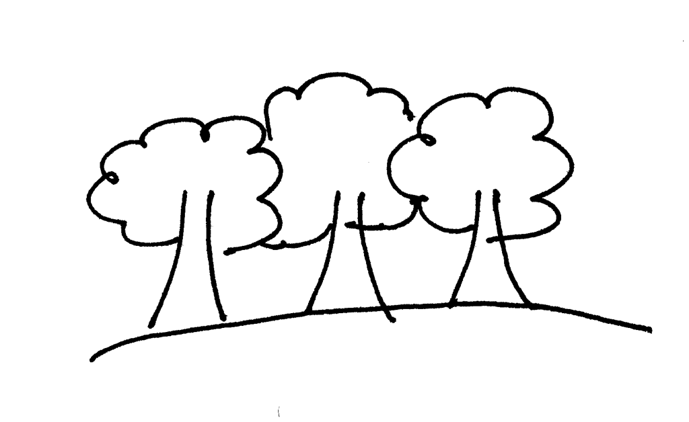

## 编写一个简单的解释器 Part 7. 抽象语法树（Abstract Syntax Tree）

[Let’s Build A Simple Interpreter. Part 7 原文链接](https://ruslanspivak.com/lsbasi-part7/)

就像我之前承诺的一样，今天我们将讨论整个系列文章中的中心数据结构的一种，跟紧我，我们出发。

到现在为止，我们的解释器代码和解析器代码混合在一起，并且一旦解析器识别出某种语言构造（例如加、减、乘、除），解释器便会执行表达式。这样的解释器称为语法指导（syntax-directed）解释器。通常直接对输入进行传递和处理，这种模式适用于基本的语言应用程序。为了分析更复杂的Pascal编程语言结构，我们需要构建一个中间表示（intermediate representation IR）。我们的解析器将负责构建IR，我们的解释器将负责使用IR作为输入并对其进行解释。

事实证明，树是非常适合IR的数据结构。



让我们快速的讨论下关于树的术语：

* 树是一种由一个或多个数据节点组织成的多层次的数据结构；
* 树有一个根节点；
* 除根节点外，所有节点都有唯一的父节点。
* 下图中标记为*的节点是父节点。标记为2和7的节点是其子节点，从左到右依次排列。
* 没有子节点的节点称之为叶子节点；
* 具有一个或多个子节点并且不是根节点的节点称为内部节点。
* 在下面的图片中，+节点的左子节点（标记为*）是一个完整的子树，具有自己的子节点。
* 在计算机科学中，我们从顶部的根节点开始向下绘制树。

这是表达式2 * 7 + 3树的说明：


我们将在整个系列中使用的IR称为抽象语法树（AST）。但是，在更深入地研究AST之前，我们先简要介绍一下解析树。尽管我们不会在解析器和编译器中使用解析树，但它们可以通过可视化解析器的执行轨迹来帮助您了解解析器如何解释输入。我们还将它们与AST进行比较，以了解为什么AST比解析树更适合作为中间表示。

那么，什么是解析树？解析树（有时称为具体语法树）是根据我们的语法定义表示语言构造的句法结构的树。它基本上显示了解析器如何识别语言构造，换句话说，它显示了语法的开始符号如何在编程语言中派生特定字符串。

解析器的调用栈隐式的表示了一个解析树，解析器自动在内存中尝试识别某种语言结构。

我们来看下表达式2 * 7 + 3 的解析树：


根据上面的图我们可以看到：

* 解析树记录了解析器应用于识别输入的一系列规则。
* 语法分析树的根就是语法的开始符号。
* 每个内部节点代表一个非终端符号，也就是说，它代表一个语法规则，例如本例中的expr、term或factor。
* 每一个叶子节点都是一个token。

正如我之前提到的，我们不会手动构造解析器树并将其用于我们的解释器，但是解析树可以通过可视化解析器调用序列来帮助您了解解析器如何解释输入。

通过使用一个名为[genptdot.py](https://github.com/rspivak/lsbasi/blob/master/part7/python/genptdot.py)小的应用程序，你可以看到解析树对于不同的算术表达式生成不同的语法树，我编写了该应用程序来帮助你完成可视化的功能。要使用该应用程序，首先需要安装[Graphviz](http://graphviz.org/)程序包，然后运行以下命令，然后打开生成的图像文件parsetree.png，并查看作为命令行参数传递的表达式生成的语法树：

```shell
$ python genptdot.py "14 + 2 * 3 - 6 / 2" > \
  parsetree.dot && dot -Tpng -o parsetree.png parsetree.dot
```

这是为表达式14 + 2 * 3 - 6 / 2生成的图像：


